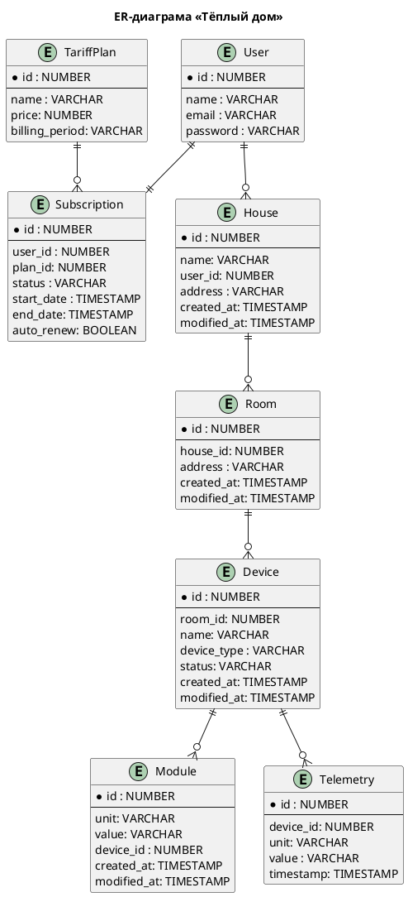

### Разработка ER-диаграммы

```puml
@startuml
title ER-диаграма «Тёплый дом»

entity "User" {
  * id : NUMBER
  --
  name : VARCHAR
  email : VARCHAR
  password : VARCHAR
}

entity "Subscription" {
  * id : NUMBER
  --
  user_id : NUMBER
  plan_id: NUMBER
  status : VARCHAR
  start_date : TIMESTAMP
  end_date: TIMESTAMP
  auto_renew: BOOLEAN
}

entity "TariffPlan" {
    * id : NUMBER
    --
    name : VARCHAR
    price: NUMBER
    billing_period: VARCHAR
}

entity "House" {
  * id : NUMBER
  --
  name: VARCHAR
  user_id: NUMBER
  address : VARCHAR
  created_at: TIMESTAMP
  modified_at: TIMESTAMP
}

entity "Room" {
  * id : NUMBER
  --
  house_id: NUMBER
  address : VARCHAR
  created_at: TIMESTAMP
  modified_at: TIMESTAMP
}

entity "Device" {
  * id : NUMBER
  --
  room_id: NUMBER
  name: VARCHAR
  device_type : VARCHAR
  status: VARCHAR
  created_at: TIMESTAMP
  modified_at: TIMESTAMP
}

entity "Module" {
  * id : NUMBER
  --
  unit: VARCHAR
  value: VARCHAR
  device_id : NUMBER
  created_at: TIMESTAMP
  modified_at: TIMESTAMP
}

entity "Telemetry" {
  * id : NUMBER
  --
  device_id: NUMBER
  unit: VARCHAR
  value : VARCHAR
  timestamp: TIMESTAMP
}

User ||--o{ House
House ||--o{ Room
Device ||--o{ Module
Room ||--o{ Device
Device ||--o{ Telemetry
TariffPlan ||--o{ Subscription
User ||--|| Subscription


@enduml
```